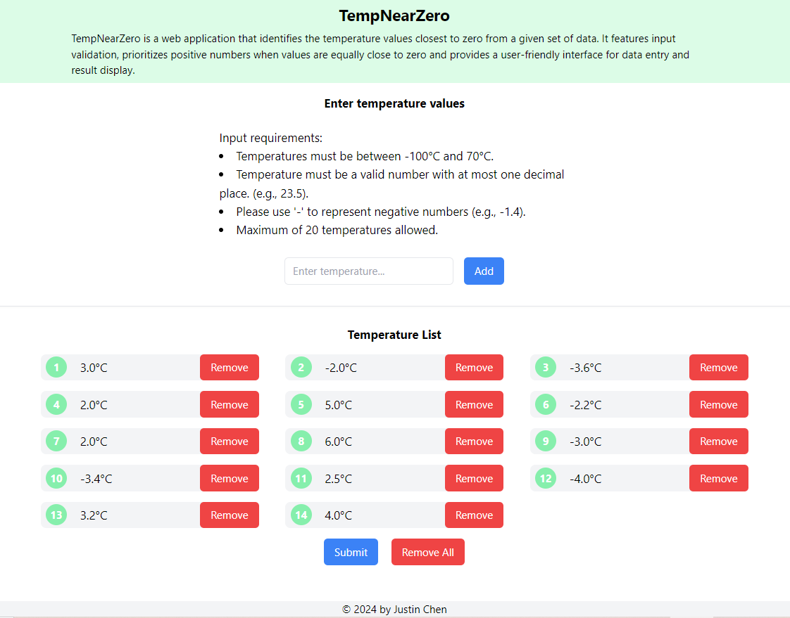
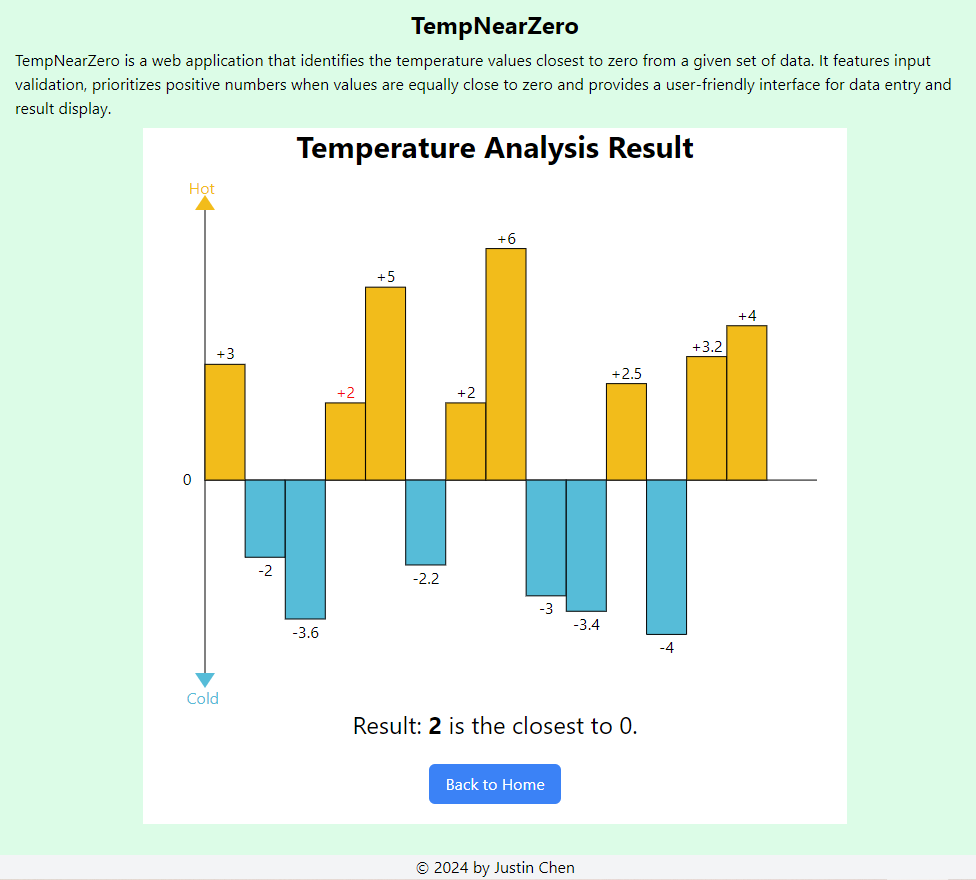

# TempNearZero

TempNearZero is a web application that identifies the temperature values
closest to zero from a given set of data. It features input validation,
prioritizes positive numbers when values are equally close to zero and
provides a user-friendly interface for data entry and result display.

## Table of Contents

- [Features](#features)
- [Screenshots](#Screenshots)
- [Technologies Used](#technologies-used)
- [Getting Started](#getting-started)
  - [Prerequisites](#prerequisites)
  - [Installation](#installation)
- [Usage](#usage)
- [Running Tests](#running-tests)
- [License](#license)

## Features

- Input multiple temperature values
- Validate temperature inputs
- Calculate and display the temperature closest to zero
- Visualize temperature data with a bar chart
- Responsive Design

## Screenshots




## Technologies Used

### Frontend

- React
- Vite
- Tailwind CSS

### Backend

- Node.js
- Express.js

### Testing

- Frontend: Vitest, React Testing Library
- Backend: Jest, Supertest
- End-to-End: Cypress

## Getting Started

### Prerequisites

- Node.js (version 18 or later)
- npm (comes with Node.js)

### Installation

1. Clone the repository

   ```sh
   git clone https://github.com/TianshengC/TempNearZero.git
   ```

2. Install frontend dependencies

   ```sh
   cd frontend
   npm install
   ```

3. Install backend dependencies
   ```sh
   cd backend
   npm install
   ```

## Usage

1. Start the backend server

   ```sh
   cd backend
   npm run dev
   ```

2. In a new terminal, start the frontend development server

   ```sh
   cd frontend
   npm run dev
   ```

3. Open your browser and navigate to `http://localhost:5173`

## Running Tests

### Frontend Tests

In the `frontend` directory:

- Run tests: `npm test`
- Run tests with coverage: `npm run test:coverage`
- Run tests with UI: `npm run test:ui`

### Backend Tests

In the `backend` directory:

- Run tests: `npm test`
- Run tests with coverage: `npm run test:coverage`

### End-to-End Tests

You must start both the frontend server and backend server before running end-to-end tests.

In the `frontend` directory:

- Run Cypress tests headlessly: `npm run cy`
- Open Cypress test runner: `npm run cy:open`

## License

All rights reserved. The code in this repository is for demonstration purposes only. No one is allowed to use, distribute, or modify the code except the code owner and individuals explicitly authorized by the owner.
